# [atet](https://github.com/atet) / [learn](https://github.com/atet/learn) / [**capture**](https://github.com/atet/learn/tree/master/capture)

[](#nolink)

# Introduction to Screen Capture

**This is part of a two-tutorial series on capturing and transcoding videos: When you're done here, please see [7. Next Steps](#7-next-steps) to finish this series**

* Estimated time to completion: 15 minutes.
* This quick introduction to screen capturing is meant to cover only the absolute necessary material to get you up and running in a minimal amount of time.
* You are here because **you want to capture images and/or video from your computer screen** (e.g. for recording video gameplay, making tutorials, etc.).
* We will be using <a href="https://en.wikipedia.org/wiki/ShareX" target="_blank">ShareX</a> to perform basic operations; advanced material is not covered here.

--------------------------------------------------------------------------------------------------

## Table of Contents

### Introduction

* [0. Requirements](#0-requirements)
* [1. Installation](#1-installation)
* [2. Setup](#2-setup)
* [3. Your First Screenshot](#3-your-first-screenshot)
* [4. Your First Animation](#4-your-first-animation)
* [5. Your First Video](#5-your-first-video)
* [6. Best Practices](#6-best-practices)
* [7. Next Steps](#7-next-steps)

### Supplemental

* [Troubleshooting](#troubleshooting)

--------------------------------------------------------------------------------------------------

## 0. Requirements

* This tutorial was developed on Microsoft Windows 10 and ShareX v13.0.1 Portable
   * **You must have administrative access on Windows**
   * ShareX is only available for Windows 7, 8.1, and 10

[Back to Top](#table-of-contents)

--------------------------------------------------------------------------------------------------

## 1. Installation

* We will use ShareX, a free, open-source graphical user interface (GUI) program for screen capturing: https://getsharex.com/downloads/
* Download the Windows Portable version from GitHub: https://github.com/ShareX/ShareX/releases/download/v13.0.1/ShareX-portable.zip
   * Note: This link may break as new versions are released

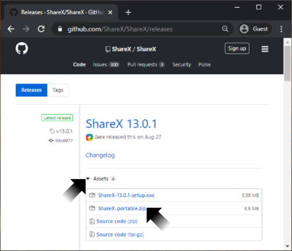(#nolink)

* Make a new folder in `C:/Program Files` named `ShareX` (this requires administrative permission)

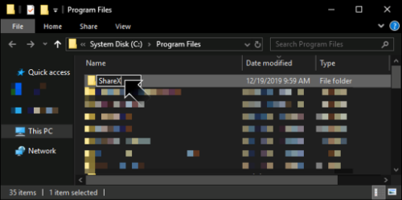(#nolink)

* Right-click on the downloaded `ShareX-portable.zip` file and "Extract All..." to the newly created "`C:\Program Files\ShareX`" (this requires administrative permission)
   * Select "Do this for all current items" if it's not selected

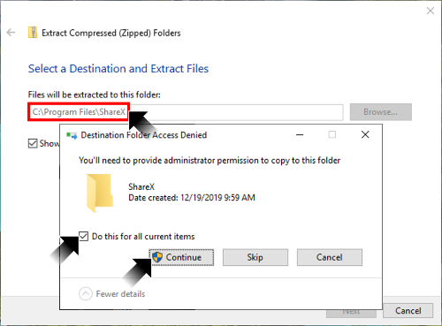(#nolink)

* Navigate to `ShareX.exe`, **right-click and "Run as administrator" (this is critical!)**
   * Some new directories must be made during the initial run (this requires administrative permission)

[](#nolink)

* **Starting ShareX for the first time, you may get a warning window** that the pre-set ShareX keyboard hotkeys clash with ones already set on your system
* Since ShareX relies on keyboard hotkeys to take a screenshot, start recording, etc., **you may want to remap those keys, or you can ignore this warning**

[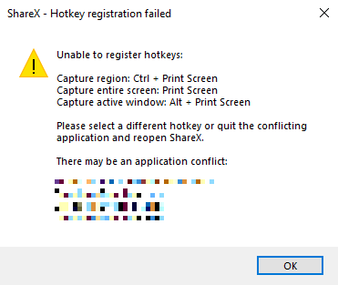](#nolink)

[Back to Top](#table-of-contents)

--------------------------------------------------------------------------------------------------

## 2. Setup

* ShareX has many advanced options that we do not need; **we must change four settings for this tutorial**:

### 2.1: Disable automatic file uploading to internet

* By default, files will automatically attempt to be uploaded to the internet right after they are captured (Imgur, Dropbox, Twitter, etc.)
* On the left-hand window pane, click on "After capture tasks" and de-select "Upload image to host"
   * Note: **It may be difficult to see what is enabled (bolded)** vs. what is disabled (not bolded) in these menus

[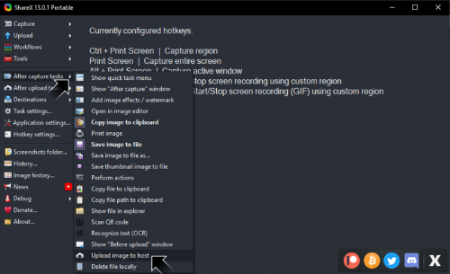](#nolink)

### 2.2: Find savepath of captured files

* On the left-hand window pane, click on "Application settings..."
* In the new window, on the left-hand side, click "Paths"
* By default:
   * Files will save to: `C:\Users\<USERNAME>\Documents/ShareX\Screenshots\<YEAR>-<MONTH>\`
   * Filenames will be in the format of `<RANDOM FILENAME>.<FILE FORMAT>`
* **Don't change anything right now, just remember where files will be saved**

[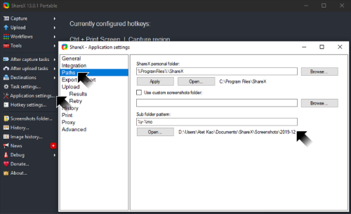](#nolink)

### 2.3: Change pattern of saved filenames

* By default, filenames are random characters
   * Though you can sort these files by "Date Created", it would be easier if the filenames had the date
* On the left-hand window pane, click on "Task settings..."
* In the new window, on the left-hand side, click "File naming"
* Change both "Name pattern for capture of clipboard upload" and "Name pattern for window capture" to the following:

```
%y%mo%d_%h%mi%s%ms
```

[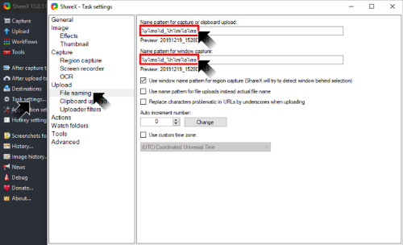](#nolink)

* The saved files will now follow an **ordered numeric format to sort the filenames** by:

```
<YEAR><MONTH><DAY>_<HOUR><MINUTE><SECOND><MILLISECOND>.<FILE EXTENSION>

E.g. 20191219_153405023.png
```

### 2.4: Change keyboard hotkeys for "Start/Stop screen recording (GIF)"

* On the left-hand window pane, click on "Hotkey settings..."
* By default, "Start/Stop screen recording (GIF)" is mapped to "CTRL + SHIFT + Print Screen"
* Press the grey button to the right of "Start/Stop screen recording (GIF)" and **press on your keyboard "CTRL + SHIFT + S"**
* Exit out of the window and you will see that this hotkey has changed in "Currently configure hotkeys"

[](#nolink)


[Back to Top](#table-of-contents)

--------------------------------------------------------------------------------------------------

## 3. Your First Screenshot

* On the left-hand window pane, click on "Capture"
* Click on "Show cursor" to disable this feature for now
* Click on "Screenshot delay" and choose "5 seconds"
* Click on "Window" and select any of your open windows

[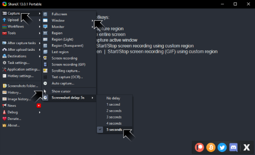](#nolink)

* Five seconds after selecting a window, ShareX will take a screenshot of that window and save it to where you specified
   * New files will also show up in the ShareX program
   * **Think about using the time delay** to open menus or perform actions before a screenshot is taken (seen below, a highlighted tooltip and a right-clicked menu was captured in the screenshot)

[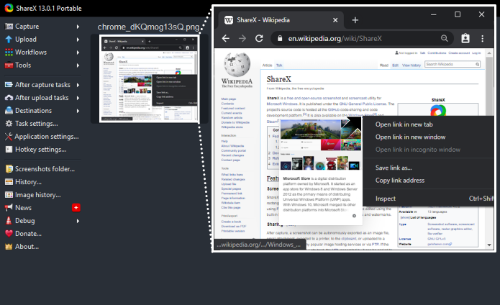](#nolink)

[Back to Top](#table-of-contents)

--------------------------------------------------------------------------------------------------

## 4. Your First Animation

* On the left-hand window pane, click on "Capture"
* Click on "Screen recording (GIF)" 
* ShareX will need to download `ffmpeg.exe` into its local directory (even if you have it on your computer already)

[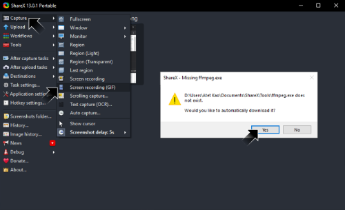](#nolink)

* After the download is successful, click "OK"

[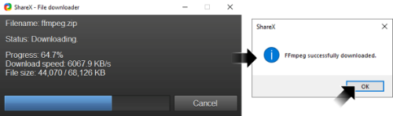](#nolink)

* Immediately after you click "OK", ShareX will prompt you to pick a window area to start recording (you can abort with right-click)
* Once you left-click on a chosen window, ShareX will start recording until you press the "Stop" button on the lower-left side (or use keyboard hotkey)

[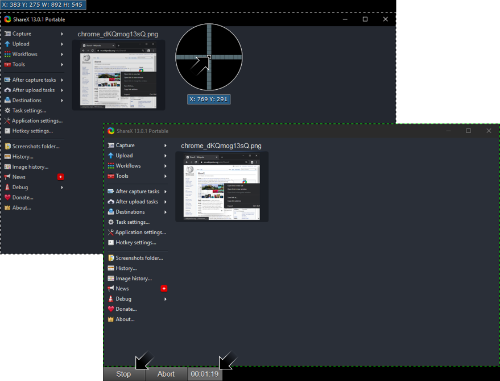](#nolink)

* After you stop the recording, ShareX will take a few moments to process your animation and save it out as `*.gif` format
* Watch my animated GIF recording of deleting the first screenshot we took (right-click on thumbnail):

[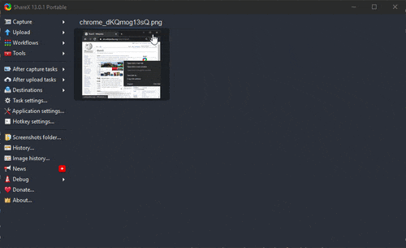](#nolink)

[Back to Top](#table-of-contents)

--------------------------------------------------------------------------------------------------

## 5. Your First Video

**This is exactly the same process as making an animated GIF**

* **You must have ffmpeg.exe downloaded from the previous step**
* On the left-hand window pane, click on "Capture"
* Click on "Screen recording" NOT "Screen recording (GIF)"

[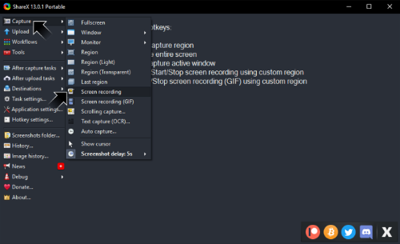](#nolink)

* You will be prompted to pick a window area to start recording (you can abort with right-click)
* Once you left-click on a chosen window, ShareX will start recording until you press the "Stop" button on the lower-left side (or use keyboard hotkey)
* After you stop the recording, ShareX will take a few moments to process your video and save it out as `*.mp4` format

[Back to Top](#table-of-contents)

--------------------------------------------------------------------------------------------------

## 6. Best Practices

### **6.1: Record at the highest quality that's appropriate for your audience**

   * AAA game replay for review; probably the best you can do
   * All text windows for hours long programming tutorial; find a balance between sufficient quality to read text clearly and file size

### **6.2: Clear your desktop and only show content on the screen that is relevant**

   * You might be used to your working environment, but some people might get distracted looking at your nice wallpaper or snooping on your notifications
   * Having a dedicated video capture computer that only has the programs you need might be useful

### **6.3: KISS ("Keep it Short & Simple")**

   * Plan out your content and rehearse: You have the opportunity to make a piece of media that is efficient, concise, and effective
   * Too many bloopers? Maybe you should break your content into smaller segments to reduce fatigue

[Back to Top](#table-of-contents)

--------------------------------------------------------------------------------------------------

## 7. Next Steps

* ShareX has some basic editing tools, but you may need more powerful programs to manipulate images, animated GIFs, and/or video
* The following are free, open-source programs:

**I highly recommend learning how to use the powerful `ffmpeg` program next: [Atet's 15 Minute Introduction to Video Transcoding](https://github.com/atet/learn/blob/master/codec/README.md#atet--learn--codec)**

Program | Format | Image Manipulation | GIF Animation Manipulation & Transcoding | Video Transcoding
--- | --- | --- | --- | ---
`ffmpeg` ([Wikipedia](https://en.wikipedia.org/wiki/FFmpeg)) | Command Line Interface | **Yes** | **Yes** | **Yes**
Avidemux ([Wikipedia](https://en.wikipedia.org/wiki/Avidemux)) | Graphical User Interface | No | No | **Yes**
GIMP ([wikipedia](https://en.wikipedia.org/wiki/GIMP)) | Graphical User Interface | **Yes** | **Yes** | No

[Back to Top](#table-of-contents)

--------------------------------------------------------------------------------------------------

## Troubleshooting

Issue | Solution
--- | ---
[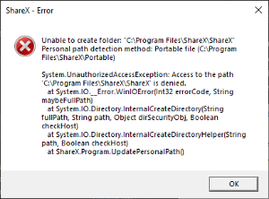](#nolink) | Run `ShareX.exe`<br>as administrator
Cursor in screenshots | Disable "Show cursor"

[Back to Top](#table-of-contents)

--------------------------------------------------------------------------------------------------

<p align="center">Copyright © 2019-∞ Athit Kao, <a href="http://www.athitkao.com/tos.html" target="_blank">Terms and Conditions</a></p>