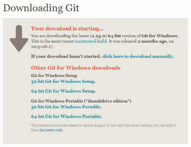
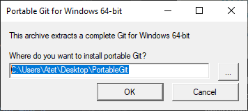
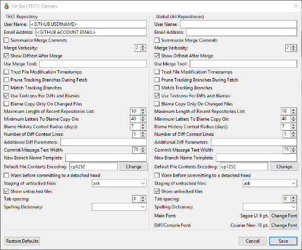
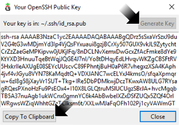

# [atet](https://github.com/atet) / [learn](https://github.com/atet/learn) / [git](https://github.com/atet/learn/tree/master/git)

# Introduction to Git (Incomplete)

* _Git and run_ in 15 minutes.
* This quick introduction to [Git](https://git-scm.com/book/en/v1/Getting-Started-Git-Basics) is meant to cover only the absolute necessary material to get you up and running in a minimal amount of time.
* You are here because you want to use a [Version Control System (VCS)](https://git-scm.com/book/en/v2/Getting-Started-About-Version-Control) to help manage your solo and/or team-based projects.
* We will be using [Git Graphical User Interface (GUI)](https://git-scm.com/download/) to connect with the [GitHub](https://github.com) web-based platform to perform basic operations; advanced material is not covered here.

--------------------------------------------------------------------------------------------------

### Table of Contents

#### Introduction
* [0. Requirements](#0-requirements)
* [1. Installation](#1-installation)
* [2. New Repository](#2-new-repository)
* [3. Add Files](#3-add-files)
* [4. Saving Changes](#4-saving-changes)
* [5. Typical Workflow](#5-typical-workflow)

#### Supplemental
* [Epilogue](#Epilogue)
* [Troubleshooting](#troubleshooting)
* [GitHub vs. other Git platforms](#gitHub-vs-other-git-platforms)

--------------------------------------------------------------------------------------------------

### 0. Requirements
* This tutorial was developed on Microsoft Windows 10.
* Git GUI is also available for MacOS and Linux.
* GitHub's platform can also be accessed through a web browser in other desktop operating systems.

[Back to Top](#table-of-contents)

--------------------------------------------------------------------------------------------------

### 1. Installation

#### Git GUI

* We will use Git Graphical User Interface (GUI) to interface with GitHub: [https://git-scm.com/download/](https://git-scm.com/download/)
* Download the "64-bit Git for Windows Portable" version: [https://github.com/git-for-windows/git/releases/download/v2.23.0.windows.1/PortableGit-2.23.0-64-bit.7z.exe](https://github.com/git-for-windows/git/releases/download/v2.23.0.windows.1/PortableGit-2.23.0-64-bit.7z.exe)
   * Note: This link may break as new versions are released.

* Unzip the file find and run "".
* After choosing your language setting and you will be presented with your working environment.

#### GitHub

* You must sign up for a free account with GitHub at [www.github.com](www.github.com) and sign in.

**After downloading and installing Git GUI and registering for a GitHub account, you should be able to complete a typical Git workflow within the next 10 minutes.**

[Back to Top](#table-of-contents)

--------------------------------------------------------------------------------------------------

### 2. New Repository

* We will create a new **repository** and **initialize** it to begin using the _repos_ (short for repository).

[Back to Top](#table-of-contents)

--------------------------------------------------------------------------------------------------

### 3. Add Files

* You can think of each repos as all the content that comprises a single project.
* Drag and drop all the files you want to include in your project in this folder

[Back to Top](#table-of-contents)

--------------------------------------------------------------------------------------------------

### 4. Saving Changes

* By **commit**ing changes, you are telling the Git system that these new, deleted, and/or modified files are ready to be incorporated in the main repository.
   * You will not see any changes on GitHub at this point.

* By **push**ing all your commits, everything gets incorporated to the master branch.
   * You will now be able to see all your commits on GitHub now.

[Back to Top](#table-of-contents)

--------------------------------------------------------------------------------------------------

### 5. Typical Workflow

* The

[Back to Top](#table-of-contents)

--------------------------------------------------------------------------------------------------

### Epilogue

* Anyone can incorporate Git into their development workflow and immediately gain benefits:
   * **Redundancy and Backup**: Files will be located in multiple places (on the GitHub platform, your computer, collaborators, etc.)
   * **Versioning**: Revert back to any previous version of your repos
* This was a quick introduction, but Git can be more powerful (and complex):
   * **Branching**: Collaborators can work on their own branch without affecting anyone else's and submit changes for your review
   * **Command Line Access**: Quickly commit-push through a terminal instead of drag-dropping

[Back to Top](#table-of-contents)

--------------------------------------------------------------------------------------------------

### Troubleshooting

Task | Link
--- | ---
Git Concepts | [https://git-scm.com/book/en/v1/Getting-Started-Git-Basics](https://git-scm.com/book/en/v1/Getting-Started-Git-Basics)
GitHub's Web-GUI Introduction | [https://guides.github.com/activities/hello-world/](https://guides.github.com/activities/hello-world/)
Git Commands Cheatsheet | [https://github.github.com/training-kit/downloads/github-git-cheat-sheet.pdf](https://github.github.com/training-kit/downloads/github-git-cheat-sheet.pdf)

[Back to Top](#table-of-contents)

--------------------------------------------------------------------------------------------------

### GitHub vs. other Git platforms

* Git and GitHub are two different systems that work together:
   * Think of GitHub as a service like Microsoft OneDrive or Dropbox, both providing cloud storage that can be accessed from a common operating system like Windows
   * Think of Git as that common operating system that can access different service providers
* GitHub is a popular service provider that will host your repository online, but there are many others that can be accessed with the same Git GUI and use the same workflow:

Company | Service | Website
--- | --- | ---
Microsoft | GitHub | www.github.com
Atlassian | Bitbucket | www.bitbucket.org
GitLab, Inc. | GitLab | www.gitlab.com

[Back to Top](#table-of-contents)

--------------------------------------------------------------------------------------------------

Copyright © 2019-∞ Athit Kao, <a href="http://www.athitkao.com/tos.html" target="_blank">Terms and Conditions</a>
