# [atet](https://github.com/atet) / [learn](https://github.com/atet/learn) / [git](https://github.com/atet/learn/tree/master/git)

# Introduction to Git

* _Git and run_ in 15 minutes.
* This quick introduction to [Git](https://git-scm.com/book/en/v1/Getting-Started-Git-Basics) is meant to cover only the absolute necessary material to get you up and running in a minimal amount of time.
* You are here because you want to use a [Version Control System (VCS)](https://git-scm.com/book/en/v2/Getting-Started-About-Version-Control) to help manage your solo and/or team-based projects.
* We will be using [Git Graphical User Interface (GUI)](https://git-scm.com/download/) to connect with the [GitHub](https://github.com) web-based platform to perform basic operations; advanced material is not covered here.

--------------------------------------------------------------------------------------------------

## Table of Contents

### Introduction

* [0. Requirements](#0-requirements)
* [1. Installation](#1-installation)
* [2. New Repository](#2-new-repository)
* [3. Clone Repository](#3-clone-repository)
* [4. Setup Connection](#4-setup-connection)
* [5. Adding Changes](#5-adding-changes)
* [6. Committing Changes](#6-committing-changes)
* [7. Pushing Changes](#7-pushing-changes)
* [8. Typical Workflow](#8-typical-workflow)

### Supplemental

* [Epilogue](#Epilogue)
* [Additional Tutorials](#additional-tutorials)
* [GitHub vs. Other Git Platforms](#gitHub-vs-other-git-platforms)

--------------------------------------------------------------------------------------------------

## 0. Requirements

* This tutorial was developed on Microsoft Windows 10.
* You are using two platforms hand-in-hand:
   * **Git GUI** downloaded on your computer (also available for MacOS and Linux).
   * **GitHub Website** accessed through most web browsers.
* You will have to go back and forth between the Git GUI program and the GitHub Website a few times during initial setup.

[Back to Top](#table-of-contents)

--------------------------------------------------------------------------------------------------

## 1. Installation

### Git GUI

* We will use Git GUI to interface with GitHub's Website.
* Download the "64-bit Git for Windows Portable" version: [https://github.com/git-for-windows/git/releases/download/v2.23.0.windows.1/PortableGit-2.23.0-64-bit.7z.exe](https://github.com/git-for-windows/git/releases/download/v2.23.0.windows.1/PortableGit-2.23.0-64-bit.7z.exe)
   * Note: This link may break as new versions are released, if so go to: [https://git-scm.com/download/](https://git-scm.com/download/)

* Run the downloaded file and have it extract to your desktop.

* Open Windows File Explorer and navigate to where you extracted PortableGit, navigate to `..\PortableGit\cmd\git-gui.exe` and run it.
* Move on to the GitHub website, you will come back to this later.

[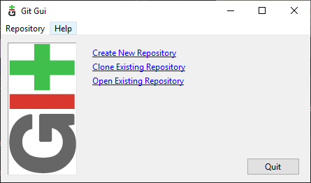](#nolink)

### GitHub Website

* You must sign up for a free account with GitHub at [www.github.com](www.github.com) and sign in.

**After downloading and installing Git GUI and registering for a GitHub account, you should be able to setup your Git credentials within the next 5 minutes.**

[Back to Top](#table-of-contents)

--------------------------------------------------------------------------------------------------

## 2. New Repository

### Create a New Repository on GitHub

* We will create a new **repository** and **initialize** it to begin using the _repos_ (short for repository).
* After you log in, click on the green "New" button:

[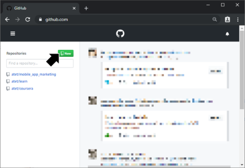](#nolink)

* Give your repos a name (e.g. "TEST"), click on "Initialize this repository with a README" (this is important), and then click the green "Create repository" button.

[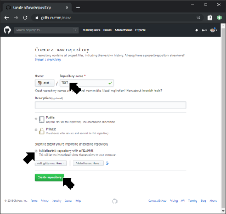](#nolink)

* After your new repos is created, click on the green "Clone or download" button on the top right and **copy the information you see here under "Clone with SSH"**, e.g. `git@github.com:atet/TEST.git`

[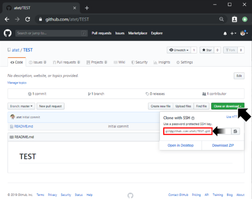](#nolink)

[Back to Top](#table-of-contents)

--------------------------------------------------------------------------------------------------

## 3. Clone Repository

* We just created the repository on GitHub's website, let's **clone** that repository so it also exists on your local computer.
* Go back to the Git GUI program and select "Clone Existing Repository"

[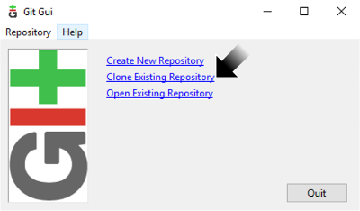](#nolink)

* Paste the information from GitHub to "Source Location", e.g. `git@github.com:atet/TEST.git`
* Choose a "Target Directory" for where the files will go locally, e.g. filepath to your desktop, then **manually add the name of the new folder to be created but does not yet exist**, e.g. "/TEST".
   * Git GUI will not let you use a directory that already exists, a new directory must be created here.

[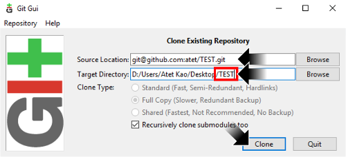](#nolink)

* Once you click "Clone" button, Git GUI will download the repos you just made on GitHub to your local Target Directory.

[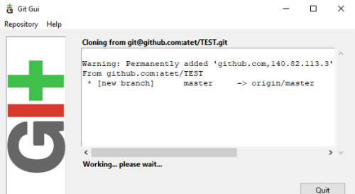](#nolink)

* Now a copy of your repos from GitHub exists locally on your computer.
* Below is what your working environment on Git GUI will look like.

[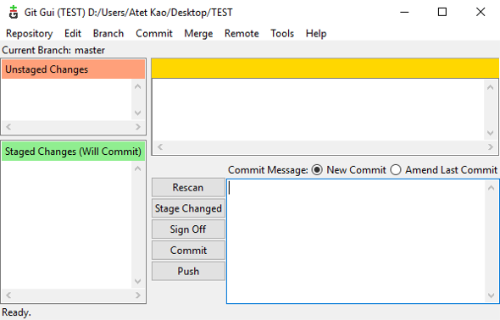](#nolink)

[Back to Top](#table-of-contents)

--------------------------------------------------------------------------------------------------

## 4. Setup Connection

* After cloning your repository, you must set up your Git GUI and GitHub website account to securely communicate with each other.

### Setup GitHub Account Credentials in Git GUI

* Go to Edit → Options...
* On the left-hand side, enter your GitHub website Username and Email Address associated with your account.
* Click "Save".

### Generate Git GUI SSH Key

* Go to Help → Show SSH Key.
* Click on "Generate Key" then "Copy To Clipboard".
   * NOTE: Your key will be a difference sequence of characters than below

### Register Git GUI SSH Key with GitHub Account:

* Click on the top-right profile picture and select Settings.
* Click on "SSH and GPG keys" on left-hand side.
* Click on green "New SSH key" button on top-right.
* Give this new key a Title and paste your Git GUI key into the Key area.
* Click on "Add SSH key".

[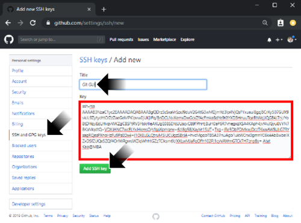](#nolink)

**After setting up your credentials between your Git GUI and GitHub account, you should be able to complete a typical Git workflow within the next 5 minutes.**

[Back to Top](#table-of-contents)

--------------------------------------------------------------------------------------------------

## 5. `Add`ing changes

* Here, we will just make a simple change to the `README.md` file:
   * Navigate to where you cloned the `TEST` repos
   * Right-click and open `README.md` file in Notepad
   * Type out "HELLO WORLD!" at the bottom and save

[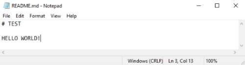](#nolink)

* `Add` these changes to your record of changes:
   * In the Git GUI, click on "Rescan" and our addition of "HELLO WORLD!" in the `README.md` file will be shown in the top-right window pane

[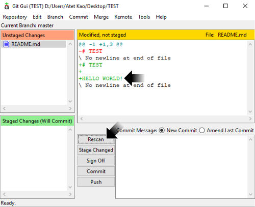](#nolink)

* Click on "Stage Changed" and it will be added to the list of changes on the bottom-left that will be sent to the master repository on GitHub when you `push` it later.

[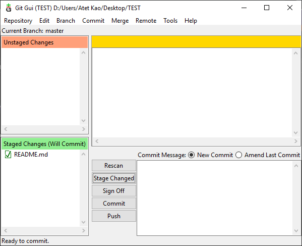](#nolink)

[Back to Top](#table-of-contents)

--------------------------------------------------------------------------------------------------

## 6. `Commit`ting Changes

* By **commit**ting changes, you are telling the Git system that these new, deleted, and/or modified files are ready to be incorporated in the main repository.
   * Add a message relating to the changes you just made, e.g. `"Added "HELLO WORLD!" to README.md."`
   * Click on "Commit"
   * _You will not see any changes on GitHub at this point yet_

[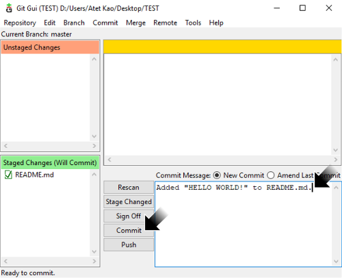](#nolink)

[Back to Top](#table-of-contents)

--------------------------------------------------------------------------------------------------

## 7. `Push`ing Changes

* By **push**ing all your commits, everything gets incorporated to the master repository on GitHub:
   * Click on "Push"
   * Below is the popup window that comes up, click on "Push" here also

[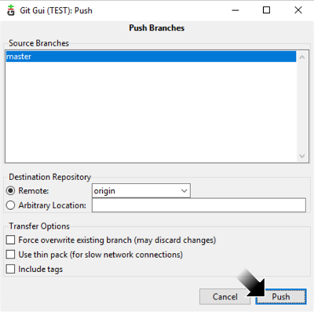](#nolink)

* Another popup window will display the status of your `push` of local changes to the master on GitHub.
   * If you setup your connection correctly on Step 4, there will not be any errors here

[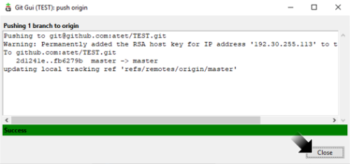](#nolink)

* _You will now be able to see all your commits on GitHub now._

[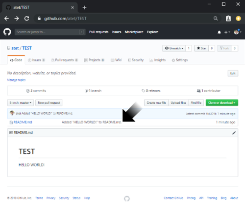](#nolink)

[Back to Top](#table-of-contents)

--------------------------------------------------------------------------------------------------

## 8. Typical Workflow

* You can think of each repos as all the content that comprises a single project. You can add, change, and/or delete files in this project and these changes will be tracked.
* Identify breakpoints in a project and organize your efforts (and commits) around them:
   * "_Initial commit of project framework including X, Y, and Z._"
   * "_Implemented backend code to allow users to sort GUI results table._"
   * "_Fixed login bug #2 that caused QA's 'Unknown User' error._"
* Once you start getting used to the version control workflow, you'll notice it's mostly just `add` → `commit` → `push`.

[Back to Top](#table-of-contents)

--------------------------------------------------------------------------------------------------

## Epilogue

* Anyone can incorporate Git into their development workflow and immediately gain benefits:
   * **Redundancy and Backup**: Copies of your files will exist in multiple locations (on the GitHub platform, your computer, collaborators, etc.)
   * **Versioning**: Revert to any previous version of your repos
* This was a quick introduction, but Git can be more powerful (and complex):
   * **Branching**: Collaborators can work on their own branch without affecting anyone else's and submit changes for review
   * **Command Line Access**: Quickly `add` → `commit` → `push` through a terminal instead of website drag-dropping or GUI button-pushing

[Back to Top](#table-of-contents)

--------------------------------------------------------------------------------------------------

## Additional Tutorials

Title | Link
--- | ---
Git Concepts | [https://git-scm.com/book/en/v1/Getting-Started-Git-Basics](https://git-scm.com/book/en/v1/Getting-Started-Git-Basics)
GitHub's Web-GUI Introduction | [https://guides.github.com/activities/hello-world/](https://guides.github.com/activities/hello-world/)
Git Commands Cheat Sheet | [https://github.github.com/training-kit/downloads/github-git-cheat-sheet.pdf](https://github.github.com/training-kit/downloads/github-git-cheat-sheet.pdf)

[Back to Top](#table-of-contents)

--------------------------------------------------------------------------------------------------

## GitHub vs. Other Git Platforms

* Git and GitHub are two different systems that work together:
   * Think of GitHub as a service like Dropbox or OneDrive, both providing cloud storage that can be accessed from the Windows operating system
   * Think of Git as that common operating system that can access different service providers
* GitHub is a popular service provider that will host your repository online, but there are many others that can be accessed with the same Git GUI or Git through command line and use the same workflow:

Company | Service | Website
--- | --- | ---
Microsoft | GitHub | www.github.com
Atlassian | Bitbucket | www.bitbucket.org
GitLab, Inc. | GitLab | www.gitlab.com

[Back to Top](#table-of-contents)

--------------------------------------------------------------------------------------------------

Copyright © 2019-∞ Athit Kao, <a href="http://www.athitkao.com/tos.html" target="_blank">Terms and Conditions</a>
