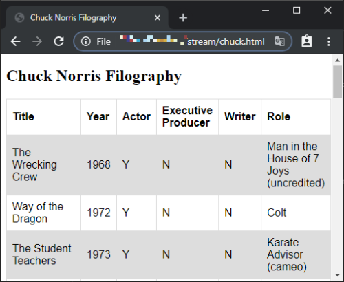
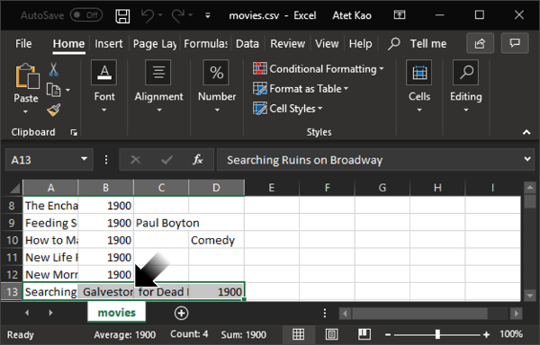
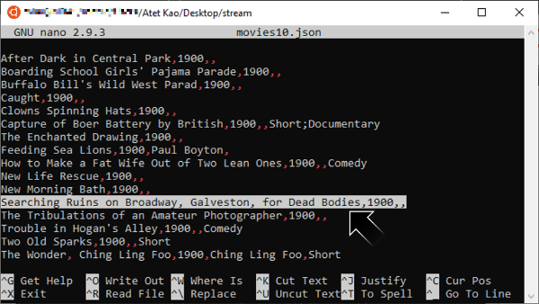
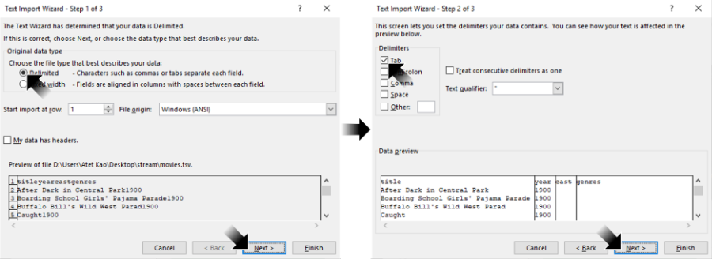
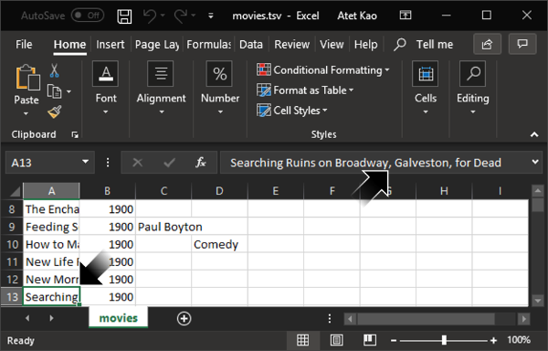

# [atet](https://github.com/atet) / [learn](https://github.com/atet/learn/blob/master/README.md#atet--learn) / [**_sed_**](https://github.com/atet/learn/blob/master/sed/README.md#atet--learn--sed)

[](#nolink)

# Introduction to Stream Editor

**This is part of a two-tutorial series on text editing in Bash: I recommend to first finish [Atet's 15 Minute Tutorial on Regular Expressions](https://github.com/atet/learn/blob/master/regex/README.md#atet--learn--regex) to put this content in better context**

**Estimated time to completion: 15 minutes**

* This introduction to stream editor (sed) covers what's absolutely necessary to get you up and running
* You are here because **you want to learn some simple tricks to quickly process huge amounts of data**
* We will be using Bash command line interface (CLI) to perform basic operations; advanced material is not covered here

--------------------------------------------------------------------------------------------------

## Table of Contents

### Introduction

* [0. Requirements](#0-requirements)
* [1. Installation](#1-installation)
* [2. Preface](#2-preface)
* [3. Example Files](#3-example-files)
* [4. Your First `sed`](#4-your-first-sed)
* [5. More `sed`](#5-more-sed)
* [6. Tabular Data](#6-tabular-data)
* [7. Bigger Data](#7-bigger-data)
* [8. The Art of Troubleshooting](#8-the-art-of-troubleshooting)
* [9. Next Steps](#9-next-steps)

### Supplemental

* [Other Resources](#other-resources)
* [Troubleshooting](#troubleshooting)
* [Acknowledgments](#acknowledgments)

--------------------------------------------------------------------------------------------------

## 0. Requirements

* This tutorial was developed on Microsoft Windows 10 with Windows Subsystem for Linux (WSL) using Ubuntu 18.04 LTS
* If you are using MacOS, [your Terminal program is Bash](https://en.wikipedia.org/wiki/Terminal_(macOS))
* Most Linux distributions use or can use Bash

[Back to Top](#table-of-contents)

--------------------------------------------------------------------------------------------------

## 1. Installation

We will use a Linux a command line interface (CLI) available on all major operating systems

### Windows 10

* Windows Subsystem for Linux (WSL) is a fully supported Microsoft product for Windows 10, learn how to install it here: https://github.com/atet/wsl

### MacOS

* You do not need to install anything, [your Terminal program is Bash](https://en.wikipedia.org/wiki/Terminal_(macOS))

### Linux

* I recommend using Ubuntu 20.04 LTS

[Back to Top](#table-of-contents)

--------------------------------------------------------------------------------------------------

## 2. Preface

### Stream Editor

> "`sed` is a stream editor. A stream editor is used to perform basic text transformations on an input stream (a file or input from a pipeline)."
>
> [gnu.org](https://www.gnu.org/software/sed/manual/sed.html#Introduction)

* Basically, `sed` can replace words with other words
* When used in combination with `grep`, you can make a powerful [pipelines (commands "piped" together using "`|`")](https://www.gnu.org/software/bash/manual/html_node/Pipelines.html) that can quickly manipulate huge amounts of data

[Back to Top](#table-of-contents)

--------------------------------------------------------------------------------------------------

## 3. Example Files

* Start your command line terminal (see "[2. Preface](#2-preface)" for options)
* Each line in the examples below starts with "`$`", _do not type this symbol, just type everything after this_
* Let's start by navigating to your home directory (a.k.a. "`~`") and make a new empty directory to work from:

```
$ cd ~
$ mkdir stream
$ cd stream
```

* Download the example file from my GitHub using `wget` and check the file's contents:

```
$ wget https://raw.githubusercontent.com/atet/learn/master/sed/data/hello.txt

<A BUNCH OF WGET STATUS TEXT>

$ ls
hello.txt
$ cat hello.txt
Hello World! Hello, hello.
```

[Back to Top](#table-of-contents)

--------------------------------------------------------------------------------------------------

## 4. Your First `sed`

### 4.1. Substitution

* Let's substitute ("`s`" prefix) "Hello" with "Goodbye":

```
$ sed "s/Hello/Goodbye/" hello.txt
Goodbye World! Hello, hello.
```

* Looks like we didn't substitute all the occurrences of "Hello", let's use the global suffix "`g`" to signify this

```
$ sed "s/Hello/Goodbye/g" hello.txt
Goodbye World! Goodbye, hello.
```

### 4.2. Multiple Patterns

* We missed the last occurence of "hello" above, this is due to the lowercase "h"
* Let's try chaining together multiple `sed` commands using the "`-e`" flag before each link:

```
$ sed -e "s/Hello/Goodbye/g" -e "s/hello/goodbye/g" hello.txt
Goodbye World! Goodbye, goodbye.
```

* Actually, let's substitute only the second and later occurrances of "Hello"; we can use the suffix with a number to signify this:

```
$ sed -e "s/Hello/Goodbye/2" -e "s/hello/goodbye/g" hello.txt
Hello World! Goodbye, goodbye.
```

### 4.3. Syntax

* Well that was easy, but what did the commands we just entered mean?
* Let's break down the above into parts:

Command | Description
--- | ---
`sed` | Calling the `sed` program
`"s/Hello/Goodbye/g"` | The processing to be done (in between quotes)
`hello.txt` | The file to be worked on

* Let's break down the processing syntax in between the quotes:

Command | Description
--- | ---
`s` | Prefix "`s`" means a substitution 
`/` | The slash character is a delimiter
`Hello` | The word to be replaced (case sensitive)
`Goodbye` | The word that is replacing the first word
`g` | Suffix "`g`" means globally change

[Back to Top](#table-of-contents)

--------------------------------------------------------------------------------------------------

## 5. More `sed`

### 5.1. Print Control

* Let's download a file that has multi-line data<sup>[[1]](#acknowledgments)</sup>:

```
$ wget https://raw.githubusercontent.com/atet/learn/master/sed/data/chuck.txt
```

* With print control we can output only lines that have specific matches
* Let's output only lines that contain a match using the suffix "`p`" (print) **combined with** the `-n` flag (see what happens if you don't use this flag in conjuction with "`p`"):

```
$ sed -n "/bird/p" chuck.txt
1. Chuck Norris can kill 2 stones with 1 bird.
```

* Let's remove lines that don't contain a match using the suffix "`d`" (deletion):

```
$ sed "/bird/d" chuck.txt
2. Death once had a near-Chuck-Norris experience.
3. Chuck Norris can hear sign language.
4. Big foot claims he saw Chuck Norris.
5. Chuck Norris makes onions cry.
```

### 5.2. Print Control with Patterns

* Adding a pattern to be searched for first before performing a replacement on that line:

```
$ sed -n "/1./ s/Chuck/Charles/p" chuck.txt
1. Charles Norris can kill 2 stones with 1 bird.
```

* Notice only the line that had a unique "`1.`" had `Chuck` substituted with `Charles`
* Additional commands can be chained together also:
   * Print control parameters should be on the last link in the chain

```
$ sed -e "/1./ s/Chuck/Charles/" -ne "s/2/two/p" chuck.txt
1. Charles Norris can kill two stones with 1 bird.
two. Death once had a near-Chuck-Norris experience.
```

* Oops, we didn't mean to change "`2.`" to `two` on the second line, need to be more specific with that second chained command:

```
$ sed -e "/1./ s/Chuck/Charles/" -ne "/1./ s/2/two/p" chuck.txt
1. Charles Norris can kill two stones with 1 bird.
```

* Let's globally change all numerals to text, e.g. "`1`" will be substituted with "`one`":

```
$ sed -e "s/1/one/g" -ne "s/2/two/gp" chuck.txt
one. Chuck Norris can kill two stones with one bird.
two. Death once had a near-Chuck-Norris experience.
```

* Oops, we didn't want to change the line numbers such as "`1.`" into text
* Let's add spaces before and after what we want to match to help make our pattern a bit more specific:
   * E.g. "`1.`" doesn't have a space before or after, so it shouldn't match

```
$ sed -e "s/ 1 /one/g" -ne "s/ 2 /two/gp" chuck.txt
1. Chuck Norris can killtwostones withonebird.
```

* We almost got it, just forgot to add spaces before and after the substitution:

```
$ sed -e "s/ 1 / one /g" -e "s/ 2 / two /g" chuck.txt
1. Chuck Norris can kill two stones with one bird.
2. Death once had a near-Chuck-Norris experience.
3. Chuck Norris can hear sign language.
4. Big foot claims he saw Chuck Norris.
5. Chuck Norris makes onions cry.
```

[Back to Top](#table-of-contents)

--------------------------------------------------------------------------------------------------

## 6. Tabular Data

* We can combine some regex syntax used in `grep` so that `sed` will recognize specific patterns to replace

### 6.1. Downloading example data

* Let's download the raw HTML code for a webpage that contains a table of information<sup>[[2]](#acknowledgments)</sup>:

```
$ wget https://raw.githubusercontent.com/atet/learn/master/sed/data/chuck.html

<A BUNCH OF WGET STATUS TEXT>

$ head -n 10 chuck.html
<!DOCTYPE html>
<html>
   <head>
      <meta charset="UTF-8">
      <style>
         table {
            font-family: Arial, Helvetica, sans-serif;
            border-collapse: collapse;
            width: 100%;
         }
```

* If you haven't seen raw HTML code, it's basically a language of organized and nested elements that describe a webpage
* Though the HTML code above could all be in one line and still work, it's best practice to make it readable with line breaks and tab spacing for editing
* This HTML code is ultimately instructions for your web browser to render it into a nice looking web page:
   * Try opening `chuck.html` in your favorite web browser

[](#nolink)

### 6.2. HTML format

* Looking back at the raw HTML, let's look at the meat of the HTML table:
   * The commands below first takes the first 35 lines of the file `chuck.html` with `head` then pipes it into `tail` to only output the last eight lines

```
$ head -n 35 chuck.html | tail -n 8
         <tr>
            <th>Title</th>
            <th>Year</th>
            <th>Actor</th>
            <th>Executive Producer</th>
            <th>Writer</th>
            <th>Role</th>
         </tr>
```

* The table will have an entry for each movie with six columns of information
* Let's look at another part of the table to see an example of a movie entry:
   * Instead of using `head` piped into `tail`, we will use `sed` to display a range of lines in the file
   * The commands below uses `sed` print control to output only lines 276 through 283

```
$ sed -n '276,283p' chuck.html
         <tr>
            <td>The Expendables 2</td>
            <td>2012</td>
            <td>Y</td>
            <td>N</td>
            <td>N</td>
            <td>Booker "The Lone Wolf"</td>
         </tr>
```

### 6.3. Goal

* Let's try converting the nested HTML table from `chuck.html` into a comma separated value (CSV) format like this:

```
Title,Year,Actor,Executive Producer,Writer,Role
.
. <NOT SHOWING ALL THE ROWS>
.
The Expendables 2,2012,Y,N,N,Booker "The Lone Wolf"
```

* This will require a few steps:
   * Extract only the table information
   * Converting a multi-line, nested entry into a single line
   * Introduce line breaks between table rows
   * Remove standard HTML tags (e.g. "`<tr>`")
   * Introduce commas between each cell of information in a row

### 6.4. Extract HTML table

* If you've noticed, there is a specific structure that HTML tables must adhere to
* We are going to use `grep` to only extract the lines that have relevant HTML table information:
   * HTML tags that define a table are "`table`", "`tr`", "`th`", and "`td`"
   * Tags come in pairs, so a beginning and end of a table would be `<table>...</table>`
   * Some tags that are not relevant to the end goal of this exercise and are not `grep`'ed over (e.g. `<head>`, `<style>`, etc. seen earlier in [6.1. Downloading example data](#61-downloading-example-data))

```
$ grep -i -e "</*table\|</*tr\|</*th\|</*td" chuck.html > chuck2.html
$ head -n 10 chuck2.html
      <table>
         <tr>
            <th>Title</th>
            <th>Year</th>
            <th>Actor</th>
            <th>Executive Producer</th>
            <th>Writer</th>
            <th>Role</th>
         </tr>
         <tr>
```

* Nice, we got rid of all the elements at the head of the file
* Let's breakdown the `grep` syntax ("`</*table\|...`") that is matched and redirected into `chuck2.html`

`grep` Syntax | Definition
--- | ---
`<` | Literal left bracket
`/*` | Literal slash and quantifier of zero or more
`table` | Literal string "`table`", with "`grep -i`" makes it case insensitive
`\\|` | Regex "or" (must be escaped with backslash)

* Let's get rid of all the nested spacing, which is just leading spaces or tabs before nested line to make the structure easier to read

```
$ sed "s/^[ \t]*//g" chuck2.html > chuck3.html
$ head -n 10 chuck3.html
<table>
<tr>
<th>Title</th>
<th>Year</th>
<th>Actor</th>
<th>Executive Producer</th>
<th>Writer</th>
<th>Role</th>
</tr>
<tr>
```

* Nice, we got rid of all the leading spaces/tabs
* Let's breakdown the `sed` processing ("`^[ \t]*`") that is replaced by nothing (i.e. deletes this pattern)

`sed` Syntax | Definition
--- | ---
`^` | Anchor at the beginning of the line
`[` `]` | Anything between this can be matched
"` `" | Literal space
"`\t`" | Tab
`*` | Quantifier zero or more

### 6.5. Compress HTML to one line

* Let's remove all the line breaks in the file (a.k.a. newline-carriage returns a.k.a. "`\n\r`") so we can convert the multi-line text to a single line
* We must use another program called `tr` (translate) to read in `chuck3.html`, make the deletion of newlines, and redirect the output into `chuck4.html`

```
$ tr -d '\n\r' < chuck3.html > chuck4.html
$ head -c 50 chuck4.html
<table><tr><th>Title</th><th>Year</th><th>Actor</t
```

* Using `head` with the `-c` flag specifies the number of characters you want to see
* Remember, all these different programs were made by different people; so the way files are read in may be different: 
   * `sed COMMAND INPUT_FILE > OUTPUT_FILE`
   * `tr COMMANDS < INPUT_FILE > OUTPUT_FILE`
   * Notice the use of "`<`" to input a file in `tr` but not used in `sed`

### 6.6. Line breaks between rows

* Replace `</tr>` with newline:

```
$ sed "s/<\/tr[^>]*>/\n/g" chuck4.html > chuck5.html
$ head -n 2 chuck5.html
<table><tr><th>Title</th><th>Year</th><th>Actor</th><th>Executive Producer</th><th>Writer</th><th>Role</th>
<tr><td>The Wrecking Crew</td><td>1968</td><td>Y</td><td>N</td><td>N</td><td>Man in the House of 7 Joys (uncredited)</td>
```

### 6.7. Remove HTML tags

* Remove `<table>` and `<tr>` tags:

```
$ sed "s/<\/*\(table\|tr\)>//g" chuck5.html > chuck6.html
$ head -n 2 chuck6.html
<th>Title</th><th>Year</th><th>Actor</th><th>Executive Producer</th><th>Writer</th><th>Role</th>
<td>The Wrecking Crew</td><td>1968</td><td>Y</td><td>N</td><td>N</td><td>Man in the House of 7 Joys (uncredited)</td>
```

* Remove beginning of line "^`<td>`", "^`<th>`" (anchor `^`)
* Remove end of line "`</td>`$", "`</th>`$" (anchor `$`):

```
$ sed "s/^<t[dh]>\|<\/t[dh]>$//g" chuck6.html > chuck7.html
$ head -n 2 chuck7.html
Title</th><th>Year</th><th>Actor</th><th>Executive Producer</th><th>Writer</th><th>Role
The Wrecking Crew</td><td>1968</td><td>Y</td><td>N</td><td>N</td><td>Man in the House of 7 Joys (uncredited)
```

### 6.8. Add commas between columns

* Substitute "`</th><th>`" and "`</td><td>`" with comma:

```
$ sed "s/<\/t[dh]><t[dh]>/,/g" chuck7.html > chuck.csv
$ head -n 2 chuck.csv
Title,Year,Actor,Executive Producer,Writer,Role
The Wrecking Crew,1968,Y,N,N,Man in the House of 7 Joys (uncredited)
```

### 6.9. Nice. You're done!

* With the last step redirecting output to `chuck.csv`, you can open this file in a spreadsheet program like Microsoft Excel:

[](#nolink)

**Congratulations! You've just performed your very first ["webscraping"](https://en.wikipedia.org/wiki/Web_scraping), a very useful skill to have in your toolbelt in this era of big data**

### 6.10. Piping

* The above could be done in one step by creating a [pipeline](https://www.gnu.org/software/bash/manual/html_node/Pipelines.html); piping the output from one command into another
   * The `wget` flag `-qO` will suppress the output of status information an makes the downloaded data ready to be piped into another command (does not save to file)
   * Output file `chuck2.csv` below will be exactly the same as `chuck.csv`

```
$ wget -qO- https://raw.githubusercontent.com/atet/learn/master/sed/data/chuck.html | \
  grep -i -e "</*table\|</*tr\|</*th\|</*td" | \
  sed "s/^[\ \t]*//g" | \
  tr -d '\n\r' | \
  sed "s/<\/tr[^>]*>/\n/g" | \
  sed "s/<\/*\(table\|tr\)>//g" | \
  sed "s/^<t[dh]>\|<\/t[dh]>$//g" | \
  sed "s/<\/t[dh]><t[dh]>/,/g" > \
  chuck2.csv
$ head -n 5 chuck2.csv
Title,Year,Actor,Executive Producer,Writer,Role
The Wrecking Crew,1968,Y,N,N,Man in the House of 7 Joys (uncredited)
Way of the Dragon,1972,Y,N,N,Colt
The Student Teachers,1973,Y,N,N,Karate Advisor (cameo)
Yellow Faced Tiger,1974,Y,N,N,Chuck Slaughter
```

### 6.11. Cleanup

* You can erase all `chuck` files by using a Bash wildcard "`*`"
* Make sure none of the files are open in other programs, otherwise the files are "locked" and cannot be deleted

```
$ rm chuck*
```

[Back to Top](#table-of-contents)

--------------------------------------------------------------------------------------------------

## 7. Bigger Data

### 7.1. Downloading example data

* Let's take a look at a bigger data set `movies.json`<sup>[[3]](##acknowledgments)</sup>, a file listing 28,794 American movies in JavaScript object notation (JSON) format

```
$ wget https://raw.githubusercontent.com/atet/learn/master/sed/data/movies.json

<A BUNCH OF WGET STATUS TEXT>

$ head -c 100 movies.json
[{"title":"After Dark in Central Park","year":1900,"cast":[],"genres":[]},{"title":"Boarding School
```

### 7.2. JSON format

* Similar to HTML, there is a specific structure a JSON file must adhere to for it to represent nested data:

```
[
   {
      "title":"After Dark in Central Park",
      "year":1900,
      "cast":[],
      "genres":[]
   },
.
. <NOT SHOWING ALL THE ROWS>
.
   {
      "title":"Destroyer",
      "year":2018,
      "cast":["Nicole Kidman","Tatiana Maslany","Sebastian Stan","Toby Kebbell","Scoot McNairy"],
      "genres":["Crime","Thriller"]
   }
]
```

### 7.3. Goal

* Fortunately, `movies.json` does not have complex structure and can easily be represented as a comma seprated value (CSV) format:

```
title,year,cast,genres
After Dark in Central Park, 1900,,
.
. <NOT SHOWING ALL THE ROWS>
.
Destroyer,2018,Nicole Kidman;Tatiana Maslany;Sebastian Stan;Toby Kebbell;Scoot McNairy,Crime;Thriller
```

**Just like parsing the Chuck Norris HTML table previously, this will require a few steps to massage the data around**

### 7.4. Line breaks between rows

* We can combine some steps here: Add a line break when we see "`},`" and also remove those characters

```
$ sed "s/},/\n/g" movies.json > movies2.json
$ head -n 2 movies2.json
[{"title":"After Dark in Central Park","year":1900,"cast":[],"genres":[]
{"title":"Boarding School Girls' Pajama Parade","year":1900,"cast":[],"genres":[]
```

### 7.5. Remove extraneous JSON syntax

* We will remove any extra "`[{`", "`}]`", "`{`", and "`"`" (quotation marks) that are not relevant in CSV format

```
$ sed "s/^\[{\|}\]$\|^{\|\"//g" movies2.json > movies3.json
$ head -n 2 movies3.json
title:After Dark in Central Park,year:1900,cast:[],genres:[]
title:Boarding School Girls' Pajama Parade,year:1900,cast:[],genres:[]
```

### 7.6. Remove JSON headers

* Unlike the HTML table we parsed earlier, we need to know a bit about the JSON structure
* Take note of the header names in the file for a later step: "`title:`", "`year:`", "`cast:`", and "`genres:`"
* We are going to delete the header names from each row along with the colon

```
$ sed "s/title\:\|year\:\|cast\:\|genres\://g" movies3.json > movies4.json
$ head -n 2 movies4.json
After Dark in Central Park,1900,[],[]
Boarding School Girls' Pajama Parade,1900,[],[]
```

### 7.7. Check comma delimiters

* Let's take a look at some later entries that have information in `cast` and/or `genre`

```
$ tail -n 1 movies4.json
Destroyer,2018,[Nicole Kidman,Tatiana Maslany,Sebastian Stan,Toby Kebbell,Scoot McNairy],[Crime,Thriller]
```

* Looks like we'll have a problem with those "extra" commas that are separating multiple entries within `cast` or `genre`
* Let's go ahead and find that pattern of info within the brackets and replace them with semicolons:

```
$ sed "s/\[.\+,.\+\]/;/g" movies4.json > movies5.json
$ tail -n 1 movies5.json
Destroyer,2018,;
```

* Oops, that just replaced the first content `sed` saw between brackets with a semicolon, basically seeing the entire `[Nicole...],[...Thriller]` as the pattern

**Well, let's try to be clever and see if we can introduce the semicolons correctly**

#### 7.7.1. Introduce line breaks

* Introduce line breaks for every `[...]` entry

```
$ sed "s/\[/\n\[/g" movies4.json > movies5.json
$ tail -n 3 movies5.json
Destroyer,2018,
[Nicole Kidman,Tatiana Maslany,Sebastian Stan,Toby Kebbell,Scoot McNairy],
[Crime,Thriller]
```

#### 7.7.2. Substitute commas with semicolons in `cast` and `genre`

* For every line that contains `]`, substitute all commas with semicolons

```
$ sed "/\[/ s/,/;/g" movies5.json > movies6.json
$ tail -n 3 movies6.json
Destroyer,2018,
[Nicole Kidman;Tatiana Maslany;Sebastian Stan;Toby Kebbell;Scoot McNairy];
[Crime;Thriller]
```

#### 7.7.3. Replace semicolon with comma

* There's one comma that was substituted to a semicolon, do you see it after "`...McNairy];`"?
* We must change that back to a comma because it delineates the information from `cast` and `genre` columns

```
$ sed "/\[/ s/];/],/g" movies6.json > movies7.json
$ tail -n 3 movies7.json
Destroyer,2018,
[Nicole Kidman;Tatiana Maslany;Sebastian Stan;Toby Kebbell;Scoot McNairy],
[Crime;Thriller]
```

#### 7.7.4. Remove line breaks

* For every line that contains a terminal comma, remove newline to make the row a single line again
* Remember like the previous section with `chuck.html`, when we remove newlines ("`\n`"), we need to use the program `tr` (translate)

```
$ tr -d '\n\r' < movies7.json > movies8.json
$ tail -c 110 movies8.json
rama]Destroyer,2018,[Nicole Kidman;Tatiana Maslany;Sebastian Stan;Toby Kebbell;Scoot McNairy],[Crime;Thriller]
```

#### 7.7.5. Reintroduce line breaks

* Now that everything is in one line again, we need to break this file back into individual rows
* Recall that the last column of information `genres` does **not** have a comma after the ending bracket "`]`", we can use this unique pattern to line break on:
   1. We will have to use the "`-E`" flag for extended regex expressions
   2. The context of "`^`" used between the brackets mean "match everything except comma", therefore "`\][^,]`" means right bracket with any character after it that is **not** a comma
   3. The parenthesis combined with `\1` is ["back referencing", a very powerful feature](https://www.gnu.org/software/sed/manual/html_node/Back_002dreferences-and-Subexpressions.html) in which the characters within are required to match, but instead of replacing them, they can be used as part of the substitution

```
$ sed -E "s/\]([^,])/\]\n\\1/g" movies8.json > movies9.json
$ tail -n 3 movies9.json
Holmes and Watson,2018,[Will Ferrell;John C. Reilly;Rebecca Hall;Ralph Fiennes;Rob Brydon;Kelly Macdonald;Lauren Lapkus;Hugh Laurie],[Action;Mystery;Comedy]
On the Basis of Sex,2018,[Felicity Jones;Armie Hammer;Justin Theroux;Jack Reynor;Cailee Spaeny;Sam Waterston;Kathy Bates],[Biography;Drama]
Destroyer,2018,[Nicole Kidman;Tatiana Maslany;Sebastian Stan;Toby Kebbell;Scoot McNairy],[Crime;Thriller]
```

#### 7.7.6. Remove extraneous JSON syntax

* Now that we're done using the brackets as markers for specific patterns, we can get rid of them (remove the `-E` flag for this)

```
$ sed "s/\[\|\]//g" movies9.json > movies10.json
$ tail -n 1 movies10.json
Destroyer,2018,Nicole Kidman;Tatiana Maslany;Sebastian Stan;Toby Kebbell;Scoot McNairy,Crime;Thriller
```

#### 7.7.7. Add back header

* Remember the column headers from earlier: "`title`", "`year`", "`cast`", and "`genres`
* We will use `sed` to put the headers back as the first line of the file: 

```
$ sed "1 i title,year,cast,genres" movies10.json > movies.csv
$ head -n 10 movies.csv
title,year,cast,genres
After Dark in Central Park,1900,,
```

* Nice, now you can open this in a spreadsheet program:

[](#nolink)

* **Oh no!** Some rows have more than four columns!
* Let's check the source data to see what's going on:

[](#nolink)

* Looks like some movie titles had commas in them (just like `cast` and `genre`) that we didn't account for

**Looks like we have a bit more work to do...**

[Back to Top](#table-of-contents)

--------------------------------------------------------------------------------------------------

## 8. The Art of Troubleshooting

* The issue we had with the JSON file is that `title` entries also had commas
* There's a million ways we can tackle this, let's brainstorm a couple:
   1. Go back to step [7.7. Check comma delimiters](#77-check-comma-delimiters) and add a step to look for commas in the `title` column?
   2. Use a different delineation symbol than the comma?
* Option #1 might work, but what about the commas already delineating the columns?
* **Option #2 actually might work really well, let's try using tabs instead of commas**

### 8.1. Tab delineation and piping

* Let's change the column delineation to tabs ("`\t`") intead of commas and put all the different steps into a pipeline:

```
$ wget -qO- https://raw.githubusercontent.com/atet/learn/master/sed/data/movies.json | \
  sed "s/},/\n/g" | \
  sed "s/^\[{\|}\]$\|^{\|\"//g" | \
  
  ### Replace ",year:" , ",cast:" , and ",genre:" with a tab "\t"
  sed "s/,year\:\|,cast\:\|,genres\:/\t/g" | \
  
  ### Remove "title:"
  sed "s/title\://g" | \
  
  ### Now we can skip most of "7.7. Check comma delimiters"
  sed "s/\[\|\]//g" | \
  sed "1 i title\tyear\tcast\tgenres" > \
  movies.tsv
$ head -n 2 movies.tsv
title   year    cast    genres
After Dark in Central Park      1900
```

### 8.2. Viewing TSV files

* Now let's check this tab separated value (TSV) file in a spreadsheet program
* Microsoft Office may not have TSV as a recognized file type; you may have to open as "All Files" and use the Text Import Wizard to specify tabs as the separator:

[](#nolink)

[](#nolink)

**Excellent! Looks like we successfully transformed the JSON file into a file we can view in a spreadsheet program**

[Back to Top](#table-of-contents)

--------------------------------------------------------------------------------------------------

## 9. Epilogue

* In this tutorial, we want to go from raw HTML or JSON to a CSV file that can be easily viewed on spreadsheet software
   * Data [munging (a.k.a. wrangling)](https://en.wikipedia.org/wiki/Data_wrangling) is the process of transforming raw data to something more useful for you
* **This transformation process is never perfect**; you may have to perform a couple deep dives and a bunch of fine tuning before you get to your end product
* Fortunately, the more experience you accumulate the easier and faster this process gets because you'll already know what common pitfalls to look out

[Back to Top](#table-of-contents)

--------------------------------------------------------------------------------------------------

## 10. Next Steps

* Data [munging (a.k.a. wrangling)](https://en.wikipedia.org/wiki/Data_wrangling) is an extensive topic that requires patience (as you've seen here) to work through troubleshooting
* I would recommend going back to try [Atet's 15 Minute Introduction to Regular Expressions](https://github.com/atet/learn/blob/master/regex/README.md#atet--learn--regex) and this tutorial over again at least one more time to cement these concepts
* After getting a good handle on the flow of how commands and pipelines are assembled, check out other free, public data sets to flex your new skills:

Data Set | Link
--- | ---
Curated Example Data Sets by Justin Dorfman | https://github.com/jdorfman/awesome-json-datasets

[Back to Top](#table-of-contents)

--------------------------------------------------------------------------------------------------

## Other Resources

Description | Link
--- | ---
`sed` Manual | https://www.gnu.org/software/sed/manual/sed.html
Bash Reference Manual | https://www.gnu.org/software/bash/manual/bash.pdf
`tr` Manual | https://www.gnu.org/software/coreutils/manual/html_node/tr-invocation.html#tr-invocation
Pipelines in Bash | https://www.gnu.org/software/bash/manual/html_node/Pipelines.html
Back Referencing in `sed` | https://www.gnu.org/software/sed/manual/html_node/Back_002dreferences-and-Subexpressions.html

[Back to Top](#table-of-contents)

--------------------------------------------------------------------------------------------------

## Troubleshooting

Issue | Solution
--- | ---
I need more delimiters for `sed` | https://stackoverflow.com/questions/33914360/what-delimiters-can-you-use-in-sed

[Back to Top](#table-of-contents)

--------------------------------------------------------------------------------------------------

## Acknowledgments

1. `chuck.txt` is adapted from: <a href="https://chucknorrisfacts.net/top-100" target="_blank">https://chucknorrisfacts.net/top-100</a>
2. `chuck.html` is adapted from: <a href="https://en.wikipedia.org/wiki/Chuck_Norris_filmography" target="_blank">https://en.wikipedia.org/wiki/Chuck_Norris_filmography</a>
3. `movies.json` is a list of American movies scraped from Wikipedia by [Peter Rust](https://github.com/prust): <a href="https://raw.githubusercontent.com/prust/wikipedia-movie-data/master/movies.json" target="_blank">https://raw.githubusercontent.com/prust/wikipedia-movie-data/master/movies.json</a> 

[Back to Top](#table-of-contents)

--------------------------------------------------------------------------------------------------

<p align="center">Copyright © 2019-∞ Athit Kao, <a href="http://www.athitkao.com/tos.html" target="_blank">Terms and Conditions</a></p>